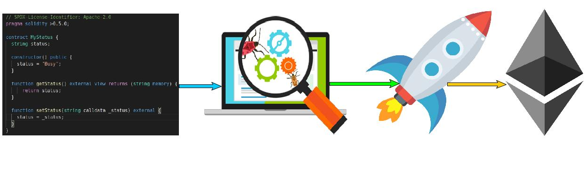

<h1 align="center">Refund by Location Smart Contract</h1>

<div>
<a href="https://github.com/Yohanes-GR/Logistic-optimization-Causal-Inference/network/members"></a>
<a href="https://github.com/Yohanes-GR/Logistic-optimization-Causal-Inference/pulls"></a>
<a href="https://github.com/Yohanes-GR/Logistic-optimization-Causal-Inference/issues"></a>
<a href="https://github.com/Yohanes-GR/Logistic-optimization-Causal-Inference/contributors"></a>
<a href="https://github.com/Yohanes-GR/Logistic-optimization-Causal-Inference/blob/main/LICENSE"></a>
</div>


</br>


<br />
<h3>Project Overview </h3>
This project demonstrates a basic Hardhat use case with an Ethereum smart contract, a test for that contract, and a script that deploys that contract. The Ethereum-smart-contract dApp is implemented to verify the other party in the contract has stayed within a predefined geographical location and based on that information it handles payment accordingly.
## Table of Contents

* [Refund-by-Location-Smart-Contract](Project Overview)

  - [Project Structure](#project-structure)
    * [images](#images)
    * [scripts](#scripts)
    * [root folder](#root-folder)
  - [Installation guide](#installation-guide)
  - [Getting Started](#getting-started)
    * [Prerequests](*prerequests)
    * [Installations](*installations)


## Project Structure

### images:

- `images/` the folder where all snapshot for the project are stored.

### scripts:

- `.scripts/`: the folder where the python implementation can be found.

### .github:

- `.github/`: the folder where github actions and CML workflow is integrated.


### root folder

- `requirements.txt`: a text file lsiting the projet's dependancies.
- `setup.py`: a configuration file for installing the scripts as a package.
- `README.md`: Markdown text with a brief explanation of the project and the repository structure.


## Installation guide

```bash
git clone https://github.com/Yohanes-GR/Refund-by-Location-Smart-Contract.git
cd Refund-by-Location-Smart-Contract
sudo python3 setup.py install
```


<!-- GETTING STARTED -->
## Getting Started
1. Open a terminal and run:
```bash
git clone https://github.com/bkget/ETH-dApp--Refund-by-Location
cd ETH-dApp--Refund-by-Location 
npx hardhat node
npx hardhat run scripts/deploy.js --network localhost
npm start
```
## Article
- [Medium Article](https://medium.com/@yohgut)
  


<!-- LICENSE -->
## License

Distributed under the MIT License. See `LICENSE` for more information
